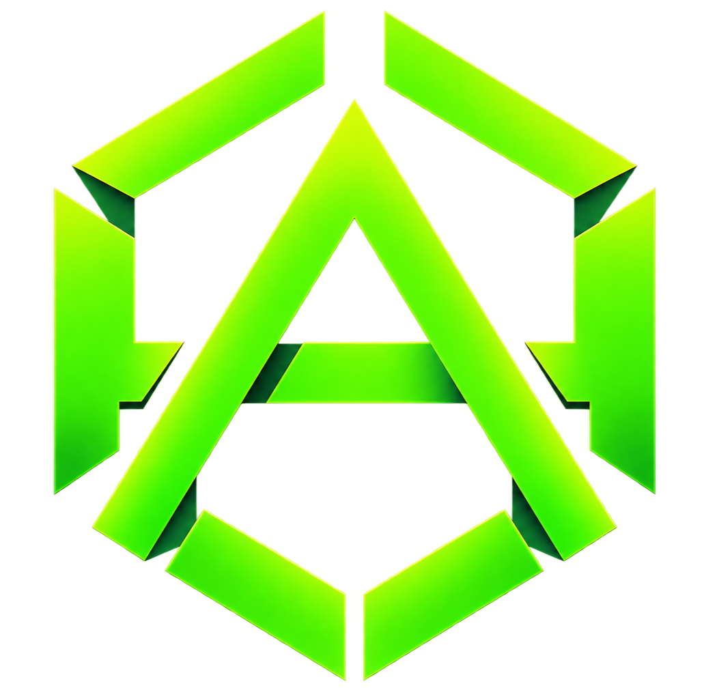

  

# DESIGN.md — A# Design System

Design tokens and system-level decisions for A#'s official site and
brand surfaces. This is the source of truth — the site's CSS custom
properties in `assets/style.css` should match these values exactly.

## Principles

- **Developer First** — built by developers, for developers.
- **Modular by Design** — everything is a block; compose with clarity.
- **Performance** — fast, efficient, and reliable by default.
- **Open & Community** — open source, built together.

## Color

### Primary Palette (5 greens)

| Token              | Value     |
| ------------------ | --------- |
| `--green-electric` | `#00FF7A` |
| `--green-lime`     | `#A7FF00` |
| `--green-matrix`   | `#39D353` |
| `--green-deep`     | `#00B341` |
| `--green-forest`   | `#009933` |

`--primary` (used for main CTAs and the logo) equals
`--green-electric`. The other four shades are used for hover states,
gradients, and depth — never as flat, isolated large-area fills.

### Neutrals

| Token          | Value     |
| -------------- | --------- |
| `--true-black` | `#0A0A0A` |
| `--charcoal`   | `#131313` |
| `--slate`      | `#1E1E1E` |
| `--gray`       | `#A1A1AA` |
| `--light`      | `#F5F5F7` |
| `--white`      | `#FFFFFF` |

## Typography

Two font families only:

| Role                        | Font           | Weights                      |
| --------------------------- | -------------- | ---------------------------- |
| Headings, UI text, body     | Satoshi        | Bold, Medium, Regular, Light |
| Code / monospace / terminal | JetBrains Mono | Regular, Medium, Bold        |

## Spacing Scale (8px base)

`8px · 16px · 24px · 32px · 40px · 48px · 56px · 64px · 72px · 80px · 96px`

## Border Radius

`4px · 8px · 12px · 16px · 24px · Full (999px)`

## UI Elements

- **Primary button** — pill-shaped, Electric Green fill, True Black text
- **Secondary button** — pill-shaped, outline, `--slate` border
- Inputs, selects, checkboxes, radios, tags, sliders, and toggles all
  use the same border radius and spacing scale as buttons — no
  one-off values.

## Code & Terminal

- Code blocks: JetBrains Mono, `--charcoal` surface, syntax colors
  drawn from the palette (keywords/purple `#8B5CF6`, functions/info
  `#3B82F6`, strings/`--green-matrix`, comments/`--gray`)
- Terminal blocks: traffic-light dots header, dual-pane code/output
  layout, Electric Green for success checkmarks

## Motion

- Standard transition: `620ms cubic-bezier(0.16, 1, 0.3, 1)`
- Scroll reveals: elements fade + rise 21px into place once ~20%
  visible
- Hero background: subtle Vercel-style dot-grid texture, plus a
  cursor-reactive glow — motion always responds to real user input
  (scroll, cursor), never plays on a loop/timer

## Logo

`assets/logo.png` — a hexagonal mark fusing the hashtag (`#`) and the
letter `A`. Represents structure, modularity, clarity, and forward
movement. Rendered in Electric Green on True Black. Minimum size
16–24px, clearspace equal to the mark's own width. Never rotated,
recolored, or given added effects.

## Application Surfaces

The mark is used consistently across: app icon, CLI icon, npm package
badge (`@asharp/core`), OG/social image, and GitHub avatar — same
mark, same green, no per-surface recoloring.

---

← [Back to README](../README.md) · [Official Site](https://aymanissa-dev.github.io/asharp/)
